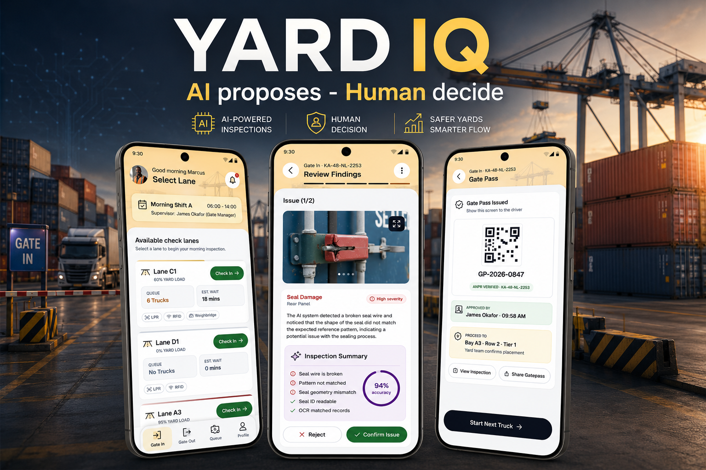

# YARD IQ — AI Gate-In Inspection

**A design case study for AI-assisted container inspection in port terminals**

Designing a mobile gate-in experience for terminal operators handling container identification, damage inspection, supervisor approval, and gatepass release — where AI accelerates the work but a named human still owns every decision.

🚀  **[View the live case study →](https://dhaval-sukharamwala.github.io/yard-iq/)**

---

## 📊 Visual Overview

---

## 🎯 The Challenge

Container terminals process hundreds of trucks daily, each requiring inspection before entering the yard. The existing manual process was:
- **Slow** — An operator walks each truck with a clipboard while the lane queues behind it; peak waits reach **18–47 minutes**
- **Error-prone** — 11-character ISO 6346 container IDs transcribed by hand, in sun glare, off a moving vehicle
- **Undefendable** — Damage found later becomes a liability dispute between yard, carrier and shipping line, with no time-stamped record of the container's condition at entry

**Goal:** Halve the gate cycle time with AI — without removing the accountable human, and without producing a system that collapses the moment a camera goes offline.

> **The real problem isn't speed. It's trust** — nobody can prove what the container looked like when it came through the gate.

---

## 🎨 Solution Overview

YARD IQ presents a **three-layer design approach:**

### 1. **AI Identification**
- Loop sensor triggers automatic OCR of plate, container ID and seal (≤ 3 s)
- Per-character display with ISO 6346 check-digit validation and confidence scores
- Automatic match against pre-advice records — missing records notify, never block
- Manual fallback preserves gate timestamps and flags the entry as manual

### 2. **Evidence-Based Inspection**
- Six surfaces scanned automatically: front, left, right, rear, roof, floor
- Findings classified by severity with photographic evidence, AI reasoning, and the case *for and against* each claim
- Operator confirms or rejects every finding — both reversible until submission
- Nothing is summarised into a verdict the operator can only rubber-stamp

### 3. **Accountable Release**
- High-severity findings route to a supervisor with a stated response window
- Delays escalate to a backup supervisor while preserving completed work
- Send-back requests a targeted re-scan; the operator's decision stays on record — not an override
- Gatepass issues with QR, ANPR-verified plate, named approver, timestamp and bay placement

---

## 🔑 Key Features

✅ **Automated Identification** — Plate, container and seal read hands-free from the lane camera  
✅ **Six-Surface Photo Evidence** — Every entry ships a time-stamped visual record  
✅ **Inspectable AI** — Confidence scores plus for/against reasoning on every finding  
✅ **Human Confirmation Required** — The AI never touches the gatepass  
✅ **Supervisor Approval Loop** — Pending, delayed, approved and sent-back all designed  
✅ **Graceful Degradation** — Camera faults and failed reads never destroy completed work  
✅ **Append-Only Audit Trail** — Decisions, re-scans and manual entries recorded, never overwritten

---

## 🛠️ Design Process

1. **Domain Research** — Studied the manual gate-in process, ISO 6346 standards, and documented operational constraints
2. **Problem Framing** — Reframed a perceived speed problem as an evidence and accountability problem
3. **Architecture** — Designed the flow as a corridor, not a web: seven stages, explicit loops, no sideways drift
4. **Failure-First Design** — Mapped edge states alongside the happy path rather than after it
5. **High-fidelity Design** — 24 screens with attention to sunlight legibility and gloved use
6. **Iteration** — Inverted the findings hierarchy after the first version read as a decision already made

---

## 📊 Design Targets

> These are success criteria defined for the concept — **not measured results.** No pilot has run.

| Metric | Target | Baseline |
| :--- | :--- | :--- |
| **Gate Cycle Time** | ≤ 6 min | ~12 min manual median |
| **Hands-Free ID Rate** | ≥ 85% | Plate + container + seal, zero correction |
| **Evidence-Gap Disputes** | → 0 | Per 1,000 entries |
| **Approval Turnaround** | ≤ 15 min | Escalation at 18 min |

**Cycle-time budget per truck:** trigger 0:30 · identify 1:00 · AI scan 1:30 · review 1:30 · approval 1:00 · release 0:30

---

## 🛡️ Designed for the Bad Days

Of the **24 screens**, 14 are happy path and **10 are edge and failure states** — plus 3 overlay sheets, for 27 frames total. **Over a third of the flow exists for things going wrong.**

| Condition | Behaviour |
| :--- | :--- |
| **Lane camera offline** | Fault banner; manual check-in opens; yard control auto-notified |
| **Container unreadable** | Retry scan or enter manually; gate timestamps preserved |
| **No pre-advice record** | Non-blocking notice; captured plate and seal carried forward |
| **Supervisor delayed** | Truck parked, gatepass held; escalation keeps the inspection intact |
| **Sent back for re-check** | Supervisor's reason in their own words; operator's call stays on record |

---

## 🔗 View the Case Study

**[Open the full interactive case study →](https://dhaval-sukharamwala.github.io/YardIQ/)**

Includes problem infographics, before/after system comparison, the emotion curve across one truck, failure-state gallery, and the full design system.

---

## 💻 Tech Stack

- **Design Tool:** Figma
- **Prototyping:** Figma interactive components
- **Research:** Domain research, process analysis, operational constraint mapping
- **Documentation:** PRD, information architecture, flow charts, task and operational workflows
- **Case study build:** Single-file HTML · inlined CSS/JS · `prefers-reduced-motion` support

---

## 📋 Project Details

| Aspect | Details |
| :--- | :--- |
| **Type** | UX/UI Design Case Study |
| **Platform** | Android — rugged shared tablet, outdoor use |
| **Scope** | Gate-In module · 24 screens designed, 2 planned |
| **Duration** | 6 weeks |
| **Year** | 2026 |
| **Team** | Solo · self-initiated concept |
| **Industry** | Logistics & Port Operations |

---

## 🎓 Key Learnings

1. **Automation needs an audience, not just accuracy** — 94% confidence is meaningless unless the operator can see *why*, and disagree
2. **The emotional low point isn't a failure state** — It's the approval hold, where the operator loses agency; those screens needed expectation-setting, not a spinner
3. **Hand-offs are where operations break** — Not screens. Every transition needed a stated expectation and preserved state
4. **Design the outage before the demo** — Building edge states first changed the architecture; retrofitting them would not have

---

## 📝 Honest Positioning

This is a **self-initiated concept project.** There was no client and no primary user research — the work is built on analysis of the existing manual process, domain research and documented operational constraints. All figures are design targets rather than measured outcomes, and the supervisor's side of the flow is assumed rather than designed. The case study states this in its own words.

---

## 📞 Get in Touch

**Questions about this design or need something similar?**

- **Portfolio:** [View all my work →](https://www.behance.net/dhaval-sukharamwala)
- **LinkedIn:** [Connect with me →](https://www.linkedin.com/in/dhaval-sukharamwala/)
- **Email:** [dhavaldvl00@gmail.com](mailto:dhavaldvl00@gmail.com)

---

**YARD IQ** · AI Gate-In Inspection Design

Designed by [Dhaval Sukharamwala](https://github.com/dhaval-sukharamwala) · 2026
